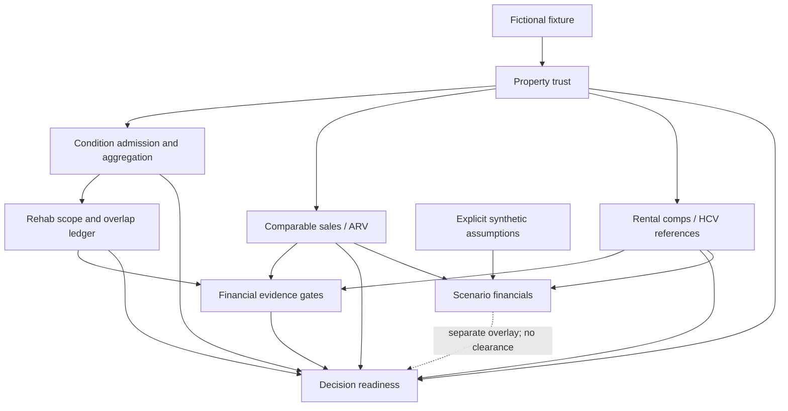

# Architecture and extraction notes

## Reused computational code

| Public module | Reused behavior | Adaptation |
|---|---|---|
| `property.py` | Observation model; reconciliation and sufficiency functions | Generic source roles replace local agency priorities; network orchestrator omitted |
| `condition/` | Typed evidence/configuration, component taxonomy, evidence admission and aggregation | Project-neutral enum names; no media files, media processors, vision providers or review archives |
| `rehab/` | Reviewed handoff admission, scope construction, quantity hierarchy, monetary helpers, selection and overlap ledger | Historical pricing lookup and commercial-rate adapter omitted; demo supplies fictional scoped quote |
| `valuation/` | Comparable normalization, exclusion, deduplication, configuration, tiering and weighted valuation | Frozen-file subject adapter removed; state-mismatch label generalized |
| `rental/market.py` | Comparable cohorts, weighting, deduplication, reference/achieved separation | Date handling uses UTC for reproducibility |
| `rental/official.py` | Date helper and reference arithmetic only | No local PHA identity, PDF/spreadsheet extraction or schedule source code |
| `financial/` | Previously public financial core and scenario helpers | Existing calculation behavior retained |
| `decision/engine.py` | Admission contracts, readiness/blockers, provenance pointers, dependency-ordered next actions | Private frozen-file loader removed; output product labels generalized |

No data from the internal corpora was needed to create the examples. The fixture was authored from scratch. Existing engine rules that remain in the edition are described as policy, not empirical accuracy claims.

## Public integration adapter

`pipeline.py` connects the reusable modules. It performs the following work:

1. Accepts only a marked synthetic case; checks observation ownership/uniqueness, availability and dates; reconciles facts.
2. Runs evidence admission and aggregation over the full component taxonomy. Converts the results into the reviewed-component contract required by rehab. A `synthetic:missing-evidence:` reference explicitly means an absent observation, never a real source. `acceptance_status=READY` admits a fictional development handoff; it does not assert production acceptance or complete condition evidence.
3. Generates scope groups and prices compatible quoted work once. Leaves hidden and unpriced exposures out of the range.
4. Derives the subject's required physical facts from Engine 1. Unresolved identity or missing required facts blocks sale/rent calculations. For an admitted fictional subject, runs ARV and rental comp engines independently of whether all rehab work has been priced; their target remains hypothetical.
5. Keeps HCV authority, utility responsibility, inspection, reasonableness, and approved contract rent unresolved. Only a fictional payment-standard reference is supplied.
6. Supplies computed synthetic values to evidence-mode financials as `REFERENCE_ONLY`. Runs an optional, separately labeled financial scenario; computed synthetic market rent and ARV are scenario assumptions. When comps are insufficient, no rent fallback is supplied. Complete rehab remains a separate explicit scenario assumption, never the Engine 3 subset.
7. Admits the six consistent contracts to the readiness engine. Adds a scenario overlay without removing blockers. Exports the six records, Engine 7 decision, full scenario, and fixture hash.

## Reproducibility and trust boundaries

- Fixed fixture dates and IDs; no clock-dependent generated report timestamps.
- JSON output is deterministic, sorted, finite-number-only serialization.
- All seven stages run offline. Installation itself needs package dependencies.
- Upstream references use engine name, JSON pointer, value, and semantic SHA-256. File path is null because records are generated in memory.
- Source-level and review-level evidence fields survive inside the synthetic envelope. Their values simulate an admitted record for testing; they do not certify a source, identity, inspection or price.
- This pipeline is an integration demonstration. Low-level functions remain available for development and require separately validated input boundaries for any real use.
